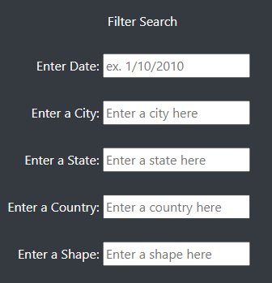
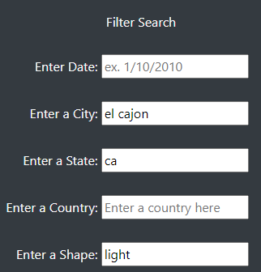
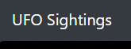

# UFOs

## Overview of Project

The purpose of this project was to create a web application to view information regarding possible UFO sightings. The data can be filtered by five different attributes:
- Date
- City
- State
- Country
- Shape of UFO
---
## Results

### - Filter Layout
The web app uses five different text fields to input filter criteria. All filters are case sensitive.

### - Entering and Clearing Criteria
After entering in the term to filter by, change the cursor location, and the data will be filtered by that input. If you want to erase a particular filter, just clear the field, and then change the cursor focus.  

### - Form Reset
To reset the whole form, which will clear all fields, simply click the **"UFO Sightings"** link at the top of the page in the navigation bar.

---
## Summary
In conclusion, while this approach offers several benefits, it is limited by the users knowledge of the data set, thus forcing them to go through the data to retrieve filter criteria before they can actually do any filtering. It could be improved upon in at least two different ways:

1. Add drop down menus for the available options, programmatically populated from the data set.

2. Add a more 'responsive' design, as the interface doesn't scale well between different screen sizes.
